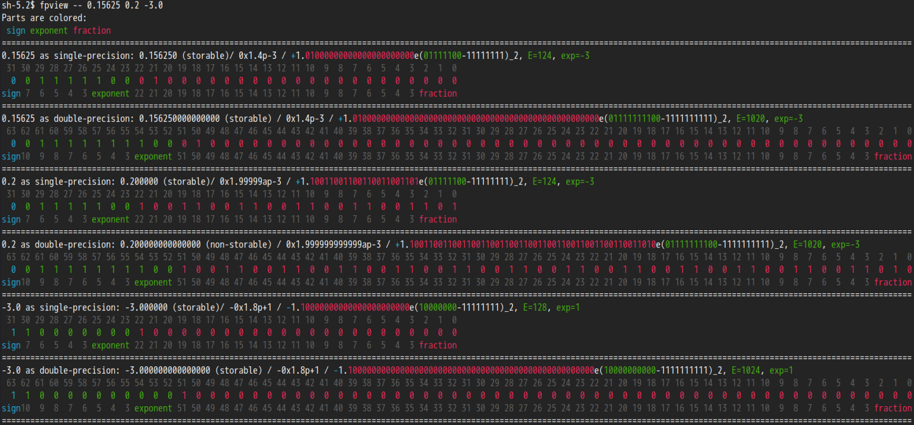

# fpview, a bitwise viewer of IEEE754 floating number on terminal

This tool shows colored, commented bitwise views of IEEE754 floating numbers, both single-precision and double-precison on terminal.



I wrote this as I recently need to deal with a lot of bitwise operation of floating numbers. And I hope this helps you out.

## Usage

`fpview (-s/--single) (-f/--float) (-d/--double) (-b/--both) (--) [number 1] ([number 2] (...))`

- `-h/--help` print a help message
- `-s/--single` show only single-precision bitwise view
- `-f/--float` alis to `-s/--single`
- `-d/--double` show only double-precision bitwise view
- `-b/--both` show both single-precision and double-precision bitwise views (default)

_Hint: due to the nature of argument parsing, you might want to add `--` before all numbers_

### Examples
- To get bitwise views of single-precision fp numbers 1.0 and 2.0:
    ```
    fpview --single 1.0 2.0
    ```
- To get bitwise views of double-precision fp numbers -0.1 and -0.2:
    ```
    fpview --double -- 0.1 0.2
    ```
- To get bitwise views of both single-precision and double-precision fp numbers 1.234 -2.3441 5.61323 -10.2323:
    ```
    fpview -- 1.234 -2.3441 5.61323 -10.2323
    ```

## Build

Make sure you have `cmake` installed, do build it, run the following commands this the current directory:
```
cmake -B build
cmake --build build
```
The result binary would be `build/fpview`

## License

See [LICENSE](LICENSE)
